# AEP Data Lifecycle Helper
## Design & Architecture Document

---

## Document Control

| Field | Value |
|-------|-------|
| Version | 3.2.0 |
| Date | 2026-06-05 |
| Status | Production-ready |
| Document owner | Tushar Kant Kar, Adobe |
| Reviewers | Engineering review board |
| Approval status | Approved for client distribution |
| Classification | Confidential — client engagement |
| Intended audience | Client teams, platform architects, security reviewers |
| Diagrams | [Figma design file](https://www.figma.com/design/G9tjo1Uq1JSfCHGfzBMrZe) → [`docs/DIAGRAMS.md`](DIAGRAMS.md) (PNGs in `docs/diagrams/figma/`); Mermaid fallback in `docs/diagrams/*.mmd`/`*.png` |

*Full change history: [`docs/CHANGELOG.md`](CHANGELOG.md).*

> **Diagrams & screenshots** in this document:
>
> 1. **Figma diagrams — embedded inline below each section.** Branded block &
>    flow diagrams with a consistent AEP-Spectrum visual system. Live, editable
>    source: **[Open in Figma](https://www.figma.com/design/G9tjo1Uq1JSfCHGfzBMrZe)**;
>    PNG exports in `docs/diagrams/figma/`, gallery in **[`DIAGRAMS.md`](DIAGRAMS.md)**.
> 2. **UI screenshots — see [§13 · UI Screen Walkthrough](#13-ui-screen-walkthrough)** at the end of this document
>    (the six live application screens; PNGs in `docs/screens/`, also in **[`SCREENS.md`](SCREENS.md)**).
> 3. **Mermaid fallback** — `docs/diagrams/*.mmd` (+ `*.png`), the version-controlled,
>    text-diffable source for each diagram's content.
```{=openxml}
<w:p><w:r><w:br w:type="page"/></w:r></w:p>
```

**Table of Contents**

```{=openxml}
<w:p><w:r><w:fldChar w:fldCharType="begin" w:dirty="true"/></w:r><w:r><w:instrText xml:space="preserve"> TOC \o "1-3" \h \z \u </w:instrText></w:r><w:r><w:fldChar w:fldCharType="separate"/></w:r><w:r><w:t xml:space="preserve">Open in Word and press F9 (or right-click the table and choose "Update Field") to build the table of contents with page numbers.</w:t></w:r><w:r><w:fldChar w:fldCharType="end"/></w:r></w:p>
```

---

## 1. Executive Summary

### What This Tool Does

The **AEP Data Lifecycle Helper** is a secure, operator-run application that
executes bulk identity deletion requests against Adobe Experience Platform (AEP)
via the Data Hygiene API. An operator supplies a CSV of source identifiers
(typically hashed customer identifiers such as `hashedKocid`), and the tool
automatically:

1. **Expands** each source identifier through the AEP Identity Graph to discover
   every linked identity — email addresses, phone numbers, ECIDs, CRMIDs, custom
   namespace IDs, and more.
2. **Plans** the resulting identities into work orders of up to 100,000 identifiers
   each, respecting both Adobe's per-day and per-month deletion quotas.
3. **Submits** each work order to Adobe's Data Hygiene API in a quota-safe,
   crash-safe, and duplicate-safe manner.
4. **Monitors** every submitted work order to completion, surfacing status in
   a browser dashboard.

### Why It Was Built

Adobe's Data Hygiene service is an API-only offering. Managing bulk deletions at
scale — across tens of thousands to millions of identifiers — requires careful
orchestration of identity resolution, quota compliance, idempotent submission, and
crash recovery. Ad-hoc scripting against this API risks silent failures against an
irreversible destructive operation. This tool codifies the correct behavior, validates
every payload before it touches Adobe's API, and tracks all state durably so
operators can stop and resume at any time.

### Key Capabilities

| Capability                     | Detail                                                         |
|--------------------------------|----------------------------------------------------------------|
| Identity graph expansion       | Follows all identity links via AEP's Private Graph             |
| Multi-namespace support        | Email, phone, ECID, CRMID, GAID, IDFA, custom namespaces       |
| Quota-aware planning           | Respects daily (default 1M/day) and monthly caps               |
| Multi-month batching           | Spans deletions across calendar months with per-month approval |
| Crash-safe submission          | Startup recovery reconciles any orphaned work orders           |
| Encrypted credential storage   | AES-256-GCM for all Adobe client secrets at rest               |
| Auto-resume scheduler          | Configurable daily schedule for unattended quota rollovers     |
| Profile-only mode              | Deletes from Identity + Profile + AJO without touching data lake |

### Architecture Principles

- **Local-first, single-process.** Runs on the operator's machine. No cloud
  infrastructure, no Docker, no Kubernetes.
- **One SQLite file for all state.** Zero administration, point-in-time
  durability, fast prepared statements.
- **Validate before the wire.** Every work-order payload is validated locally
  before any network call. Adobe's irreversible API is never reached with a
  malformed request.
- **Non-idempotent hygiene POST.** Adobe's deletion call is never automatically
  retried on failure — duplicate submissions create duplicate irreversible deletes.

---

## Scope, Assumptions & Boundaries

### In scope / Out of scope

**In scope**

- Single-operator bulk identity deletion against Adobe Experience Platform via the Data Hygiene (record-delete) API.
- Identity Graph expansion of each source identifier into all linked identities (email, phone, ECID, CRMID, and custom namespaces).
- Quota-aware batching that groups identities into work orders within Adobe's per-work-order and daily/monthly quota limits.
- Submission, progress monitoring, and status tracking of every work order through to completion.
- Crash-safe recovery and reconciliation of in-flight work after a restart.

**Out of scope**

- Multi-user or SaaS-hosted deployment.
- Web-UI authentication or user-account management.
- Distributed coordination across multiple machines or instances.
- Non-CSV input formats.
- Mixed-namespace source identifiers within a single job.

### Key assumptions

- A single local operator runs the tool on one machine.
- The runtime is Node.js 20 LTS.
- The tool is the **exclusive** quota writer for the target organization. Where concurrent external writers cannot be ruled out, `QUOTA_SAFETY_BUFFER` is set to reserve headroom against them.
- `DATA_DIR` is located **outside** any cloud-sync path (OneDrive, Dropbox, Google Drive, iCloud), since it holds the encryption key and encrypted credentials.
- The server is bound to loopback only (`127.0.0.1`).
- Operator-supplied credentials are valid for the target region and sandbox.

### Boundaries / non-goals

- **No web-UI authentication.** The tool relies on a loopback trust model: whoever can reach the local socket is trusted to operate it.
- **Single-process only.** A second instance pointed at the same database is blocked by a database-path advisory lock.
- **Deletes are irreversible.** The tool validates every payload aggressively before calling Adobe, but it cannot undo a deletion once Adobe has completed it.

---

## 2. System Architecture

### 2.1 High-Level Architecture

The tool is a single Node.js process running on the operator's machine.
There is no cloud infrastructure — all data, state, and secrets live
locally. The only outbound traffic is HTTPS calls to Adobe's documented
APIs.

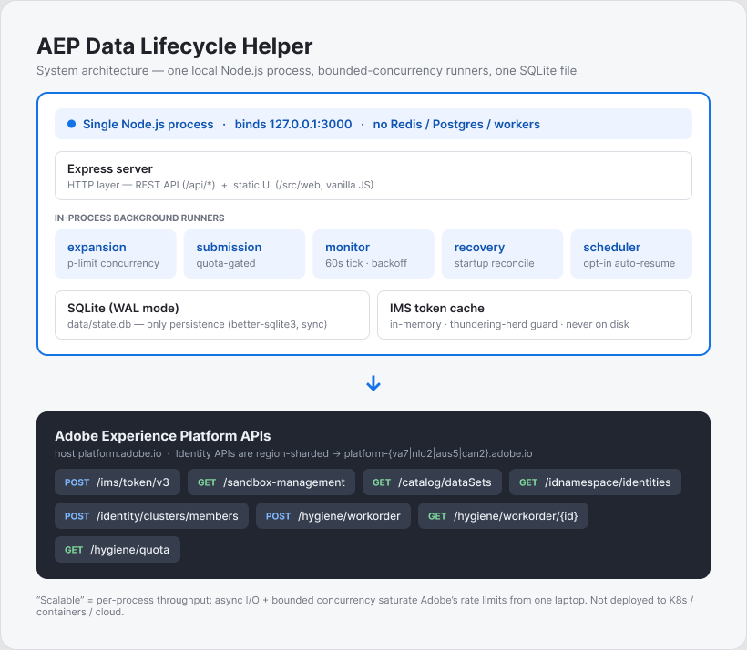

*Browser ↔ loopback HTTP ↔ Node.js Express process (Routes + Background
Runners + Adobe Service Layer + Security middleware) ↔ HTTPS to Adobe
Experience Platform (IMS Auth, Identity Service, Platform Services,
Data Hygiene API). All persistence in `data/state.db` (SQLite WAL).
Source: `docs/diagrams/01-system-architecture.mmd`.*

### 2.2 Component Summary

| Component             | File                          | Responsibility                                              |
|-----------------------|-------------------------------|-------------------------------------------------------------|
| Express server        | `src/index.js`                | Boot, route mounting, runner startup, security middleware   |
| Config                | `src/config.js`               | Env-var defaults; all tunables in one place                 |
| Database              | `src/db.js`                   | SQLite schema, migrations, all prepared statements          |
| Expansion runner      | `src/runner/expansion.js`     | CSV stream → batched Identity Graph calls → SQLite          |
| Submission runner     | `src/runner/submission.js`    | Planner + quota-gated work-order submission                 |
| Redistributor         | `src/runner/redistributor.js` | Re-buckets unshipped WOs against live Adobe quota           |
| Monitor runner        | `src/runner/monitor.js`       | 60s polling of Adobe work-order status                      |
| Recovery runner       | `src/runner/recovery.js`      | Boot-time orphan reconciliation and expansion resume        |
| Auto-resume scheduler | `src/runner/scheduler.js`     | Configurable daily auto-submit on quota rollover            |
| IMS auth              | `src/services/imsAuth.js`     | Token cache with thundering-herd guard                      |
| Adobe HTTP client     | `src/services/adobeClient.js` | axios with retry, backoff, auth injection, error enrichment |
| Identity Graph        | `src/services/identityGraph.js` | POST /clusters/members, both response shapes              |
| Hygiene               | `src/services/hygiene.js`     | Work-order payload validation + POST                        |
| Quota API             | `src/services/quotaApi.js`    | Live Adobe /quota with 1h cache and 24h hard floor          |
| Quota manager         | `src/services/quotaManager.js`| SQLite-backed daily + monthly ledgers (atomic reserve)      |
| Security middleware   | `src/middleware/security.js`  | Host guard, CSRF guard, error handler                       |
| Crypto                | `src/utils/crypto.js`         | AES-256-GCM envelope encryption for client secrets         |

### 2.3 Technology Stack

| Layer          | Choice          | Reason                                                        |
|----------------|-----------------|---------------------------------------------------------------|
| Runtime        | Node.js 20 LTS  | Long-term support; `better-sqlite3` has prebuilt binaries     |
| HTTP server    | Express 4       | Minimal, well-understood, no magic                            |
| Database       | SQLite (WAL)    | Zero-admin, single-file, crash-safe; sufficient throughput    |
| SQLite driver  | better-sqlite3  | Synchronous API; ~100k rows/sec bulk insert; no async queuing |
| HTTP client    | axios           | Interceptors for auth inject, retry, error enrichment         |
| Concurrency    | p-limit         | Simple, battle-tested async concurrency limiter               |
| CSV parsing    | fast-csv        | Streaming; never loads entire file into memory                |
| UI             | Vanilla JS/HTML | No build step; edit and refresh; no bundler dependency        |
| Testing        | node --test     | Built-in; no Jest/Mocha install; nock for HTTP mocking        |

---

## 3. End-to-End Data Flow

### 3.1 Operator Journey Overview

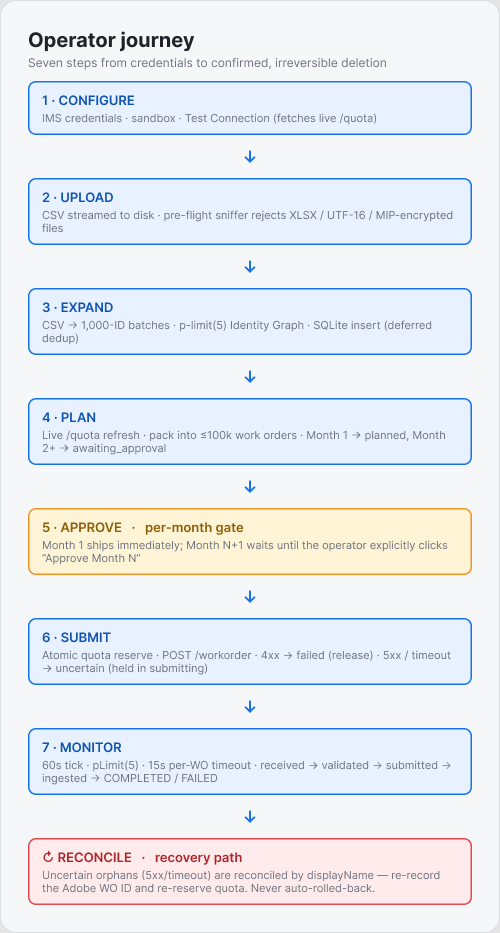{width=3.6in}

*Seven steps left-to-right: **Configure → Upload → Expand → Plan →
Approve → Submit → Monitor**. Approve is a per-month gate (Month 1 ships
immediately; Month 2+ requires `POST /api/jobs/:id/approve-month`).
Submit's uncertain failure path (5xx / timeout / network) leaves the
WO in `submitting` for **Reconcile** to recover — the local DB is
brought back in sync with Adobe by displayName lookup. Source:
`docs/diagrams/02-operator-journey.mmd`.*

### 3.2 Expansion Data Flow

The expansion pipeline turns a streamed CSV into deduplicated rows in
`expanded_identities`, calling Adobe Identity Graph in bounded waves
along the way. Every step is rate-limit-aware and crash-safe.

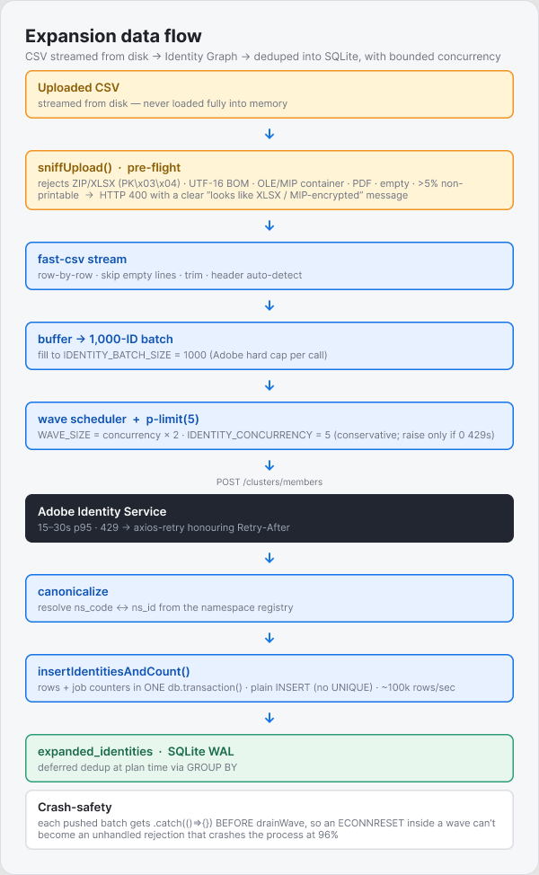{width=4.1in}

*Upload → `sniffUpload()` rejects non-CSV payloads (ZIP/XLSX, UTF-16,
MIP-encrypted, etc.) before fast-csv runs → row-by-row stream → buffer
fills to `IDENTITY_BATCH_SIZE=1000` → **wave scheduler** caps in-flight
batches at `IDENTITY_CONCURRENCY × 2` (default 5 × 2 = 10) → `p-limit`
sends each batch through `POST /clusters/members` (axios-retry honours
`Retry-After` on 429) → canonicalize ns_code ↔ ns_id from the registry
→ `insertIdentitiesAndCount` writes the rows + job counters inside
`db.transaction()` (one fsync per batch). Plain INSERT — dedup is deferred
to plan time. Per-batch
log line carries `adobeMs`, `sqliteMs`, every 50 batches a summary with
`p50` / `p95` / `rateLimitHits`. Source: `docs/diagrams/07-expansion-data-flow.mmd`.*

### 3.3 Step-by-Step Detail

```
┌─────────────────────────────────────────────────────────────────────────┐
│  STEP 1 — CONFIGURE                                                     │
│                                                                         │
│  Operator enters in the Config tab:                                     │
│    • IMS Org ID, Client ID, Client Secret                               │
│    • Region (va7 / nld2 / aus5 / can2)                                  │
│    • Environment (Production / Stage / Development)                     │
│                                                                         │
│  On "Test Connection":                                                  │
│    POST /ims/token/v3 ──► bearer token (cached in memory, 24h TTL)      │
│    GET  /sandbox-management/ ──► sandbox list                           │
│    GET  /quota ──► live daily + monthly caps displayed in UI banner     │
│                                                                         │
│  Client secret stored: AES-256-GCM encrypted in data/state.db          │
│  IMS token: in-memory only (never written to disk)                      │
└─────────────────────────────────────────────────────────────────────────┘
           │
           ▼
┌─────────────────────────────────────────────────────────────────────────┐
│  STEP 2 — UPLOAD                                                        │
│                                                                         │
│  Operator selects:                                                      │
│    • Target namespace (e.g. hashedKocid)                                │
│    • Deletion scope (ALL datasets / specific datasets / profile-only)   │
│    • CSV file of source identifiers                                     │
│                                                                         │
│  Server:                                                                │
│    Streams CSV to data/uploads/  (never fully in memory)                │
│    Counts rows → sets job.source_count                                  │
│    Creates jobs row with status = 'ready'                               │
└─────────────────────────────────────────────────────────────────────────┘
           │
           ▼
┌─────────────────────────────────────────────────────────────────────────┐
│  STEP 3 — EXPAND  (runner/expansion.js)                                 │
│                                                                         │
│  Operator clicks "Start Identity Expansion" on the Jobs tab.            │
│                                                                         │
│  ┌──────────────────────────────────────────────────────────────────┐  │
│  │  CSV stream                                                       │  │
│  │    │                                                              │  │
│  │    ▼ read 1,000 IDs per batch (Adobe hard limit)                  │  │
│  │  ┌────────────┐  ┌────────────┐  ┌────────────┐  ┌────────────┐ │  │
│  │  │  Batch 1   │  │  Batch 2   │  │  Batch 3   │  │   ...      │ │  │
│  │  └─────┬──────┘  └─────┬──────┘  └─────┬──────┘  └────┬───────┘ │  │
│  │        │               │               │               │         │  │
│  │        └───────────────┴───────────────┴───────────────┘         │  │
│  │                         │ p-limit(10) concurrent                  │  │
│  │                         ▼                                         │  │
│  │              POST /identity/clusters/members                      │  │
│  │              (region-specific host per credential)                │  │
│  │                         │                                         │  │
│  │                         ▼                                         │  │
│  │              Response: clusters[].members[]                       │  │
│  │              Each member: { nsid, id }                            │  │
│  │              Canonicalized to { code, nsid } via namespace index  │  │
│  │                         │                                         │  │
│  │                         ▼                                         │  │
│  │              INSERT into expanded_identities (SQLite)             │  │
│  │              (plain INSERT, no unique constraint,                 │  │
│  │               dedup performed at planning time via GROUP BY)      │  │
│  └──────────────────────────────────────────────────────────────────┘  │
│                                                                         │
│  Wave scheduling: batches processed in waves of 20 (concurrency × 2)  │
│  to keep memory constant regardless of file size.                       │
│                                                                         │
│  On completion: COUNT DISTINCT identities → set job.found_count         │
│  Job status: expanding → expanded                                        │
└─────────────────────────────────────────────────────────────────────────┘
           │
           ▼
┌─────────────────────────────────────────────────────────────────────────┐
│  STEP 4 — PLAN  (runner/submission.js::planWorkOrders)                  │
│                                                                         │
│  1. Fetch live quota from Adobe GET /quota (with 1h cache)             │
│  2. Run redistributor: assign day_index + month_index to any           │
│     existing unshipped work orders                                      │
│  3. Stream expanded_identities, deduplicated via GROUP BY               │
│     (ns_code, ns_id, identity_id), ordered by source_id                │
│  4. Bundle identities per cluster (keep clusters together)              │
│  5. Pack bundles into work orders (≤ 100,000 identifiers each)          │
│  6. Assign day_index (advance day when daily cap would overflow)        │
│     and month_index (advance month when monthly cap would overflow)     │
│  7. Month 1 work orders → status = 'planned'                            │
│     Month 2+ work orders → status = 'awaiting_approval'                 │
│     (operator must explicitly approve each future month)                │
│                                                                         │
│  Guard: throws HTTP 409 (ReplanForbiddenError) if any work order       │
│  has already shipped to Adobe — prevents duplicate deletions.           │
└─────────────────────────────────────────────────────────────────────────┘
           │
           ▼
┌─────────────────────────────────────────────────────────────────────────┐
│  STEP 5 — APPROVE  (if multi-month job)                                 │
│                                                                         │
│  Month 1 ships immediately on Submit.                                   │
│                                                                         │
│  Month 2, 3, … are shown in the Plan tab as "Awaiting Approval".        │
│  Operator reviews the planned quantity and clicks "Approve Month N".    │
│                                                                         │
│  POST /api/jobs/:id/approve-month  { monthIndex: 2 }                   │
│    → flips WOs from awaiting_approval → planned                         │
│    → Month N becomes eligible for the next Submit run                   │
│                                                                         │
│  This gate prevents accidental multi-month submissions and gives        │
│  operators a review checkpoint before each month's quota is consumed.   │
└─────────────────────────────────────────────────────────────────────────┘
           │
           ▼
┌─────────────────────────────────────────────────────────────────────────┐
│  STEP 6 — SUBMIT  (runner/submission.js::runSubmission)                 │
│                                                                         │
│  For each planned (or deferred) work order:                             │
│                                                                         │
│  ┌──────────────────────────────────────────────────────────────────┐  │
│  │  Quota check (SQLite atomic transaction)                          │  │
│  │    daily_used + count ≤ daily_limit?   ──No──► mark DEFERRED     │  │
│  │    monthly_used + count ≤ monthly_limit?──No──► mark DEFERRED    │  │
│  │    Both pass ──► reserve quota (increment both ledgers)          │  │
│  │         │                                                         │  │
│  │         ▼                                                         │  │
│  │  POST /data/core/hygiene/workorder                                │  │
│  │    Payload validated locally before the call:                     │  │
│  │      • ≤ 100,000 identifiers total                                │  │
│  │      • datasetId format (ALL / id / comma-list)                   │  │
│  │      • targetServices ↔ datasetId="ALL" consistency               │  │
│  │      • each namespace has code and/or numeric id                  │  │
│  │         │                                                         │  │
│  │         ├─ Success ──► record Adobe work-order ID, mark SUBMITTED │  │
│  │         ├─ Quota denied (429) ──► safe to retry; token refresh    │  │
│  │         ├─ Adobe 4xx (rejected) ──► mark FAILED, release quota    │  │
│  │         ├─ 5xx / timeout / network ──► stay SUBMITTING            │  │
│  │         │   (uncertain); quota HELD; reconciled on recovery       │  │
│  │         └─ Quota denied by our ledger ──► mark DEFERRED           │  │
│  └──────────────────────────────────────────────────────────────────┘  │
│                                                                         │
│  Deferred orders retry automatically after UTC midnight rollover.       │
│  The auto-resume scheduler can handle this unattended.                  │
└─────────────────────────────────────────────────────────────────────────┘
           │
           ▼
┌─────────────────────────────────────────────────────────────────────────┐
│  STEP 7 — MONITOR  (runner/monitor.js, every 60 seconds)                │
│                                                                         │
│  For each submitted work order (up to 100 per tick, p-limit(5)):        │
│    GET /data/core/hygiene/workorder/{adobe_workorder_id}                │
│                                                                         │
│  Status transitions persisted in SQLite:                                │
│    received → validated → submitted → ingested → completed              │
│                                              └─────────────► failed     │
│                                                                         │
│  Monitor tab in the UI refreshes every 15 seconds showing:              │
│    • Per-job cards with completion progress bars                         │
│    • In-flight jobs always ranked first (never pushed off-screen)        │
│    • Per-work-order pipeline table in the detail panel                   │
│    • Sandbox filter chips for multi-sandbox operators                    │
└─────────────────────────────────────────────────────────────────────────┘
```

---

## 4. Work Order Lifecycle

### 4.1 State Machine

The work-order lifecycle is a strict state machine. Every state
transition is logged. Terminal states (`completed`, `failed`) never
move backward.

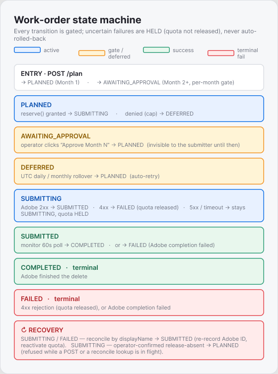{width=5in}

*Entry from `POST /api/jobs/:id/plan` produces **PLANNED** (Month 1)
or **AWAITING_APPROVAL** (Month 2+). The per-month approval gate flips
awaiting → planned via `POST /approve-month`. `runSubmission` reserves
quota → either advances to **SUBMITTING** (POST in flight) or marks
**DEFERRED** (cap hit; retries on UTC rollover). Adobe 2xx →
**SUBMITTED**; Adobe 4xx → **FAILED** with quota released; 5xx /
timeout / network → stay in **SUBMITTING**, quota held, awaiting
reconcile. Monitor polls submitted WOs to terminal **COMPLETED** /
**FAILED**. Source: `docs/diagrams/03-work-order-state-machine.mmd`.*

### 4.2 Crash & uncertain-submit recovery

When a submit times out (the Hygiene POST is non-idempotent — see
§10.4), the WO is left in `submitting` with no `adobe_workorder_id`.
The startup orphan-recovery routine *and* the operator-triggered
`POST /api/jobs/:id/reconcile` route both look the WO up in Adobe by
its `displayName` prefix and apply one of four outcomes:

| Outcome | Action |
|---|---|
| **Match found** — Adobe has the WO under our persisted `display_name` | Record `adobe_workorder_id`; non-terminal Adobe status → `submitted`, terminal (completed/failed) → local completed/failed + `completed_at`; `markAccepted` (or `reactivate` if it was `failed`). The write is CAS-guarded so concurrent reconcile results stay monotonic. |
| **No match** — Adobe returned 200 but our `display_name` is not in the list | INDETERMINATE — a no-match does NOT prove absence (work-order creation is async, no read-after-write guarantee). If status was `submitting`, **leave it in `submitting` with its reservation HELD** — never auto-roll-back, which would risk a duplicate on retry. The operator confirms absence in Adobe's UI, then uses the per-WO **release-absent** action to release + retry. If status was `failed`, leave as failed but AMBIGUOUS — a no-match does NOT prove absence (a legacy/timeout `failed` Adobe may actually have processed), so it stays `failure_definitive=0` and ordinary job-delete fail-closes. |
| **Indeterminate** — Adobe rejected the lookup with 4xx | Leave the WO alone; the next reconcile attempt retries. Never roll back on ambiguity. |
| **Transient lookup error** — network failure during reconcile | Leave the WO alone; retry on next boot or next manual reconcile click. |

The UI shows a yellow banner on the Submit tab whenever any WO is in
`submitting`/`failed` without an `adobe_workorder_id`, with a
**↻ Reconcile** button that fires `POST /api/jobs/:id/reconcile`. No
restart required.

### 4.3 Status Reference

| Status                | Description                                                    | Next action           |
|-----------------------|----------------------------------------------------------------|-----------------------|
| `planned`             | Work order created locally; ready to submit to Adobe           | runSubmission picks up |
| `awaiting_approval`   | Month 2+ gate; operator must approve before submission         | Click "Approve Month N" |
| `deferred`            | Quota exhausted for today / this month; will retry after UTC rollover | Auto-resumes next day  |
| `submitting`          | Two meanings: (a) POST to Adobe in flight, (b) UNCERTAIN — POST timed out / network reset / 5xx; Adobe may have processed it, quota still reserved | Recovery / reconcile by `displayName` |
| `submitted`           | Adobe ACK'd with a work-order ID; monitoring in progress       | Monitor polls 60s      |
| `completed`           | Adobe confirms deletion complete (terminal)                    | Export results         |
| `failed`              | Two kinds: **definitive** — a 4xx rejection, `failure_definitive=1`, Adobe never created it so no quota spent → safe to delete; **ambiguous** — a legacy/timeout outcome with no Adobe ID, `failure_definitive=0` → Adobe may have processed it, so ordinary job-delete is blocked (409 `unsettled`) until reconciled (or `?force=true`). A monitor-reported `failed` has an Adobe ID → terminal, not ambiguous. | Review error message; reconcile (settles any Adobe actually has); for ambiguous, verify in Adobe + `?force=true` |

### 4.4 Submit → reconcile flow

End-to-end view of a single submit, including how an uncertain failure
gets resolved either by startup recovery or by the operator-triggered
reconcile button — without losing data or double-spending Adobe quota.

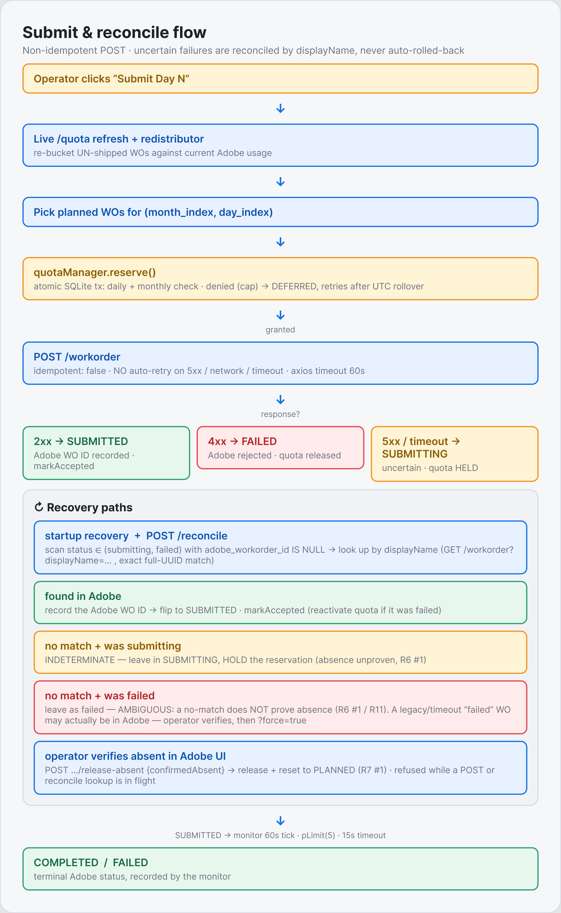{width=4.15in}

*Quota reserve gates the POST; the four post-POST outcomes
(**SUBMITTED** / **DEFERRED** / **FAILED** / **SUBMITTING-uncertain**)
each have a precise recovery path. SUBMITTING-uncertain WOs come back
to life via the orphan-recovery path (boot-time or
`POST /api/jobs/:id/reconcile`); previously-FAILED WOs can also be
reconciled if found in Adobe (re-reserves the quota the previous
error-handling path released).*

---

## 5. Multi-Month Quota Planning

### 5.1 Why Multi-Month Planning Exists

Adobe's Data Hygiene API enforces two quota dimensions:

- **Daily cap**: typically 1,000,000 identifiers per day (varies by contract)
- **Monthly cap**: typically 3,000,000 identifiers per month (varies by contract)

A large deletion batch (e.g. 4 million identifiers from a 1.5M-row CSV after
graph expansion) will span multiple calendar months. The planner assigns each
work order to a `(month_index, day_index)` bucket upfront, so the operator can
see the full timeline before any work is submitted.

### 5.2 Planning Diagram

For a job of 2,500,000 expanded identifiers against the typical Adobe
caps (1,000,000/day, 3,000,000/month), the planner produces:

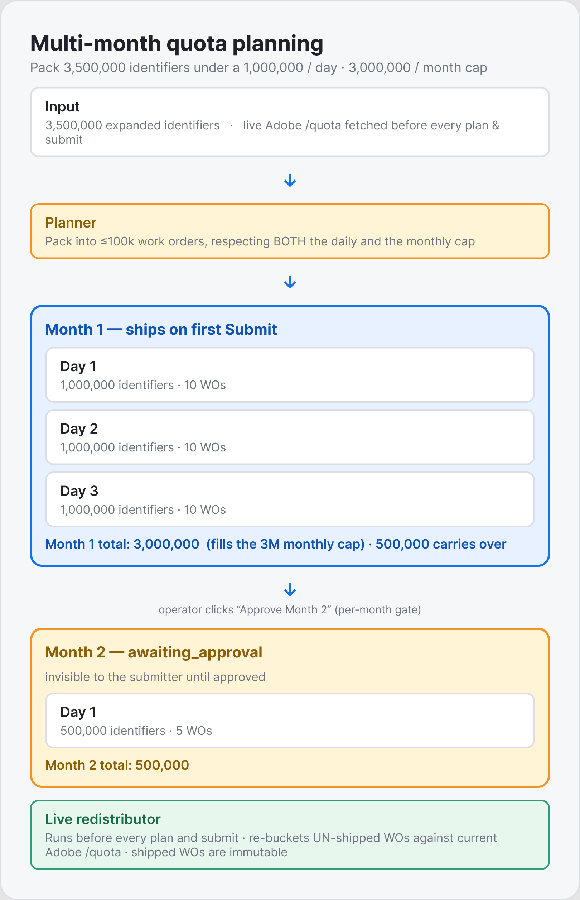{width=4.35in}

*Month 1 (blue) ships immediately when the operator clicks Submit on
Day 1. Month 2 (orange) stays in `awaiting_approval` until the
operator clicks **Approve Month 2** — a per-month sign-off gate so
nobody accidentally lets a multi-month deletion run unattended.
**Total job: 2,500,000 identifiers, 4 days across 2 months, 25 WOs**.
The **live redistributor** (green) runs before every plan and submit,
so day/month bucketing always reflects the current Adobe `/quota`
numbers, not what they were when the plan was first built. Source:
`docs/diagrams/04-multi-month-planning.mmd`.*

### 5.3 Live Quota Redistribution

The redistributor (`src/runner/redistributor.js`) fires:

- After `planWorkOrders` builds the initial plan
- At the top of every `runSubmission` call
- (optionally) on every scheduler tick

It walks unshipped WOs in `rowid` order, fits each into the current
day's remaining capacity, advances day / month indices when caps would
overflow, and persists the new `(day_index, month_index)` in a single
transaction. **Shipped WOs are immutable** — the redistributor only
touches WOs in `planned`, `deferred`, or `awaiting_approval` status.
The identity content (`namespaces_identities` JSON) of any existing WO
**never changes** — only the bucket labels do. This is the "if someone
else's app consumed 300 k of your daily quota since you planned, push
our remaining work to a later window" behaviour the operator can rely on.

> **Day-label continuity.** When a job ships across multiple days, the
> redistributor seeds the starting `(month, day)` of the un-shipped tail from
> the highest already-shipped window and continues past it, so a remainder
> reads as "Day 2" rather than resetting to "Day 1". This is a label-only
> change: it never alters identity content or the quota reservation, so the
> no-over-ship guarantee holds and shipped work orders stay immutable. The UI
> also lands on the first day that still has pending work.

---

## 6. Adobe API Integration

### 6.1 API Summary

| Method | Endpoint                                                    | Purpose                        | Host                          |
|--------|-------------------------------------------------------------|--------------------------------|-------------------------------|
| POST   | `/ims/token/v3`                                             | IMS bearer token               | ims-na1.adobelogin.com        |
| GET    | `/data/foundation/sandbox-management/`                      | List active sandboxes          | platform.adobe.io             |
| GET    | `/data/foundation/catalog/dataSets`                         | List Identity-enabled datasets | platform.adobe.io             |
| GET    | `/data/core/idnamespace/identities`                         | List identity namespaces       | platform-{region}.adobe.io    |
| POST   | `/data/core/identity/clusters/members`                      | Expand identity cluster        | platform-{region}.adobe.io    |
| POST   | `/data/core/hygiene/workorder`                              | Create record-delete WO        | platform.adobe.io             |
| GET    | `/data/core/hygiene/workorder/{id}`                         | Poll work-order status         | platform.adobe.io             |
| GET    | `/data/core/hygiene/quota`                                  | Live daily + monthly quota     | platform.adobe.io             |

### 6.2 Region Architecture

Identity Service APIs are regionally sharded. A wrong-region call to
`/clusters/members` returns HTTP 200 with **empty** cluster data — the
operator would see "no linked identities" and proceed to delete only
the source `hashedKocid`, leaving the linked email / phone / CRMID
alive. This is the single worst failure mode in the system, so the
region routing is a per-credential field validated by a server-side
allowlist.

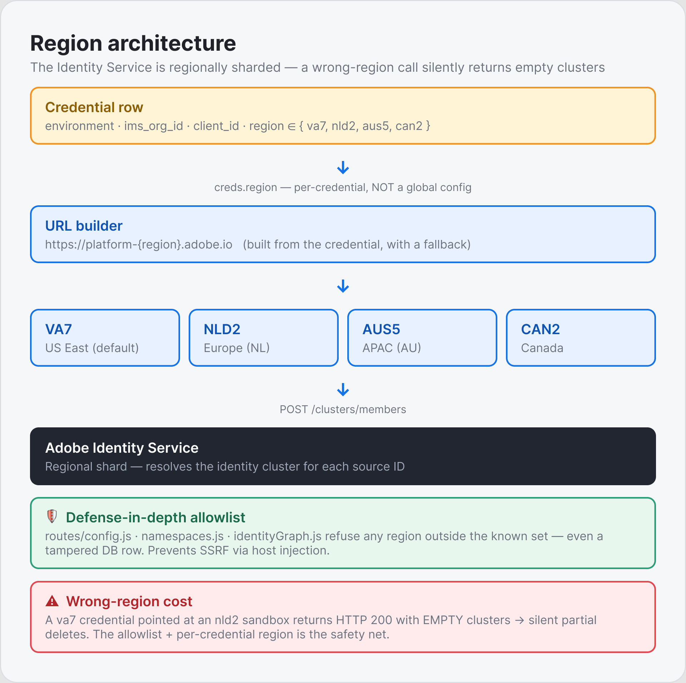

*Each credential row carries its own `region`. The URL builder
templates `https://platform-${region}.adobe.io` from that field — never
from a global default. Three layers of defence-in-depth allowlist
(`routes/config.js`, `namespaces.js`, `identityGraph.js`) refuse to
build an Identity host with any value outside `{va7, nld2, aus5, can2}`,
even if a tampered DB row holds something exotic — preventing SSRF
via host injection. Source: `docs/diagrams/05-region-architecture.mmd`.*

### 6.3 Work-Order Payload

```json
{
  "action": "delete_identity",
  "datasetId": "ALL",
  "displayName": "Delete job-abc123 - WO 1 - Day 1",
  "description": "Bulk identity deletion - 95,000 identifiers",
  "targetServices": ["identity", "profile", "ajo"],
  "namespacesIdentities": [
    {
      "namespace": { "code": "email", "id": 6 },
      "ids": ["user@example.com", "user2@example.com"]
    },
    {
      "namespace": { "code": "hashedKocid", "id": 11124296 },
      "ids": ["abc123hash", "def456hash"]
    }
  ]
}
```

**Payload constraints (all validated locally before the network call):**

| Field                  | Constraint                                                                  |
|------------------------|-----------------------------------------------------------------------------|
| `ids` total count      | 1 – 100,000 (Adobe hard limit)                                              |
| `datasetId`            | `"ALL"` \| single dataset ID \| comma-joined list (no mixing `"ALL"` with specific IDs) |
| `targetServices`       | When present: must be `["identity","profile","ajo"]` AND `datasetId` must be `"ALL"` |
| Namespace entry        | Each entry must have `code` (string) and/or `id` (numeric nsid)             |

### 6.4 Identity Quota

| Dimension | Default | Configurable via |
|-----------|---------|-----------------|
| Daily cap | 1,000,000 identifiers | Adobe contract; read from live `/quota` |
| Monthly cap | 3,000,000 identifiers | Adobe contract; read from live `/quota` |

Adobe's `/quota` endpoint is the **source of truth**. The tool's stored
`daily_limit`/`monthly_limit` values are fallbacks used only when the live
endpoint is unreachable and no cache exists.

---

## 7. Security Architecture

### 7.1 Defense-in-Depth Model

The threat model: the local web UI has **no authentication**, the tool
submits **irreversible** deletes, and a malicious browser tab the
operator already has open must not be able to drive that API. Six
layers protect against it.

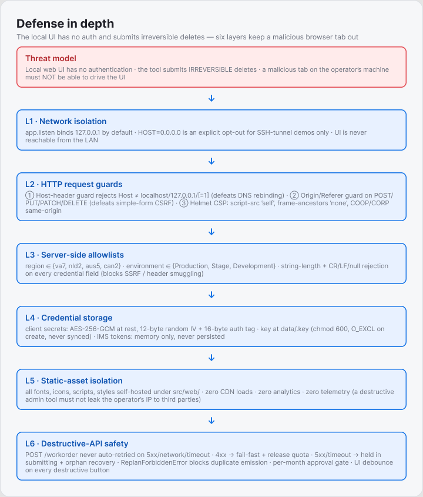

*Layers 1-5 are network → HTTP → allowlist → credential → asset
isolation. Layer 6 covers the destructive-API specific safety
(non-idempotent retry policy, replan-forbidden guard, per-month
approval gate, UI-level debounce on every destructive button). Source:
`docs/diagrams/06-defense-in-depth.mmd`.*

**Per-layer notes:**

- **L1 · Network isolation** — `app.listen(port, '127.0.0.1', …)` binds
  loopback by default. `HOST=0.0.0.0` is an explicit opt-out (intended
  for SSH-tunneled demos only, never production).
- **L2 · HTTP request guards** in `src/middleware/security.js`:
  - **Host-header guard** rejects `Host: anything-other-than-localhost`
    — the only defense against DNS rebinding (a malicious page resolves
    `attacker.com → 127.0.0.1`, the browser then talks to localhost
    thinking it's still same-origin with the attacker; the Host header
    however still says `attacker.com`, and the guard refuses).
  - **Origin / Referer guard** on every state-changing method
    (POST/PUT/PATCH/DELETE).
  - **Helmet CSP** `script-src 'self'`, `frame-ancestors 'none'`,
    `object-src 'none'`, COOP/CORP `same-origin`.
- **L3 · Allowlists** — `region ∈ {va7, nld2, aus5, can2}` and
  `environment ∈ {Production, Stage, Development}` are enforced both
  at the route layer (PATCH/POST `/credentials`) and at the service
  layer (`namespaces.js`, `identityGraph.js`), so even a tampered DB
  row can't make us build a host outside the allowlist. Every
  credential field is length-bounded and rejects CR/LF/null (header
  smuggling defence).
- **L4 · Credential storage** — client secrets are AES-256-GCM at rest
  with a 12-byte random IV per row and a 16-byte auth tag. The key
  file `data/.key` is created with `O_EXCL` (no race on first run),
  `chmod 600` on POSIX. IMS tokens stay in memory only, refreshed
  120s before expiry, with a thundering-herd guard so concurrent
  callers share a single in-flight refresh.
- **L5 · Static asset isolation** — every font, icon, script and
  stylesheet is self-hosted under `src/web/`. Zero CDN loads. Zero
  analytics. An admin tool for destructive operations cannot leak the
  operator's IP / user-agent / timing to a third-party origin.
- **L6 · Destructive-API safety** — the hygiene POST is deliberately
  non-idempotent (`{idempotent: false}` in axios-retry), so a 5xx /
  timeout / network error never triggers an auto-retry that could
  duplicate an irreversible delete. ReplanForbiddenError (HTTP 409)
  blocks re-emission of work orders for already-shipped identities.
  The per-month approval gate forces explicit operator sign-off for
  Month 2+. Every destructive UI button is debounced via
  `onClickGuarded`.

### 7.2 Submission Safety

```
  CRITICAL: Adobe work orders are IRREVERSIBLE. The following safeguards
  prevent duplicate or erroneous submissions:

  1. Payload validation before every POST — 5 checks in hygiene.js
     (identifier count, datasetId format, targetServices consistency,
      namespace shape, no duplicate namespace groups)

  2. Non-idempotent retry policy — network errors and 5xx responses
     are NOT retried for the hygiene POST. Only 401 (token refresh)
     and 429 (rate limit) are retried, because those unambiguously
     mean Adobe did NOT process the request.

  3. ReplanForbiddenError — attempting to re-plan after any work order
     has shipped returns HTTP 409. The UI disables the Re-plan button
     automatically. Prevents re-emitting identities already deleted.

  4. Orphan recovery — if the process crashes between quota reservation
     and Adobe's ACK, startup recovery looks up the work order by its
     persisted displayName. Match → record the Adobe ID + markAccepted.
     No-match or indeterminate (400 / network) → leave in `submitting` with the
     reservation HELD; NEVER auto-roll-back — a no-match doesn't prove
     Adobe absence. The operator resolves a confirmed-absent one via the
     release-absent action.
```

---

## 8. Environment Configuration Reference

### 8.1 Complete Environment Variable Reference

All variables are optional. The tool runs with zero `.env` configuration
on first launch. Set these to tune behavior for your deployment.

#### Network & Server

| Variable       | Default         | Description                                                                                                           |
|----------------|-----------------|-----------------------------------------------------------------------------------------------------------------------|
| `PORT`         | `3000`          | HTTP port the Express server listens on. Change if 3000 is in use.                                                    |
| `HOST`         | `127.0.0.1`     | Bind address. Default is loopback-only (safe). Set to `0.0.0.0` ONLY for SSH-tunnel demos. Exposes the unauthenticated API to the LAN — add authentication before doing this in any shared environment. |
| `OPEN_BROWSER` | `1`             | Set to `0` to prevent automatic browser launch on `npm start`.                                                        |

#### Storage Paths

| Variable      | Default                  | Description                                                                                                          |
|---------------|--------------------------|----------------------------------------------------------------------------------------------------------------------|
| `DATA_DIR`    | `./data`                 | Directory for all persistent state (database, encryption key, uploads, output). **Move this outside OneDrive / iCloud / Dropbox** to avoid cloud-sync interference with SQLite WAL files. Recommended: `%LOCALAPPDATA%\aep-lifecycle-helper` on Windows, `~/.local/share/aep-lifecycle-helper` on Linux/macOS. |
| `DB_PATH`     | `$DATA_DIR/state.db`     | Override the SQLite database file path directly. Useful for pointing at an existing database from a different `DATA_DIR`. |
| `UPLOAD_DIR`  | `$DATA_DIR/uploads`      | Directory for streamed CSV uploads. Must be writeable.                                                               |
| `OUTPUT_DIR`  | `$DATA_DIR/output`       | Directory for exported result CSVs.                                                                                  |

#### Security

| Variable         | Default                 | Description                                                                                                           |
|------------------|-------------------------|-----------------------------------------------------------------------------------------------------------------------|
| `ENCRYPTION_KEY` | *(auto-generated)*      | 32-byte hex string used for AES-256-GCM encryption of client secrets. If not set, the key is auto-generated and stored in `$DATA_DIR/.key` on first run. Set this explicitly if you want the key to survive a `data/` reset, or to use a key managed by your secrets manager. **Do not commit this value.** |

#### Performance Tuning (scalability knobs)

| Variable                  | Default     | Description                                                                                                           |
|---------------------------|-------------|-----------------------------------------------------------------------------------------------------------------------|
| `SQLITE_CACHE_MB`         | `512`       | SQLite page cache in megabytes. Larger cache = fewer disk I/Os during expansion and planning. Each MB covers approximately 256 × 4KB pages. See per-machine recommendations below. |
| `IDENTITY_CONCURRENCY`    | `5`         | Maximum parallel `POST /clusters/members` calls during expansion. Adobe's Identity Graph supports up to ~10–20 concurrent requests before 429 rate-limiting becomes frequent. |
| `IDENTITY_BATCH_SIZE`     | `1000`      | Source identifiers per Identity Graph batch call. 1,000 is Adobe's hard maximum — do not increase. Decrease only if you encounter payload-size errors. |
| `WORK_ORDER_CONCURRENCY`  | `2`         | Parallel work-order POSTs during submission. Adobe's Hygiene API is not highly parallelized — keep at 1–3. |
| `MAX_IDS_PER_WORK_ORDER`  | `100000`    | Identifiers per work order. 100,000 is Adobe's hard maximum. Do not increase. Decrease only for debugging. |
| `REQUEST_TIMEOUT_MS`      | `60000`     | HTTP request timeout in milliseconds (60 seconds). Increase for very slow network connections or VPN routing. |
| `QUOTA_SAFETY_BUFFER`     | `0`         | Fraction (0–0.95) of each Adobe quota held back as headroom for **concurrent external writers** the tool cannot see between its once-per-run `/quota` snapshot and its submit. Default `0` assumes this tool is the only quota writer for the org; set e.g. `0.1` to reserve 10% if other writers are possible. |

#### Quota Fallbacks

These values are **fallbacks only**. The tool always prefers live quota from
Adobe's `GET /quota` endpoint. These are used only when the endpoint is
unreachable and no cache exists.

| Variable                   | Default       | Description                                                                                                           |
|----------------------------|---------------|-----------------------------------------------------------------------------------------------------------------------|
| `DAILY_IDENTIFIER_LIMIT`   | `1000000`     | Fallback daily identifier deletion cap. Match your Adobe contract entitlement. |
| `MONTHLY_IDENTIFIER_LIMIT` | `3000000`     | FALLBACK monthly identifier cap (live Adobe `/quota` wins). Adobe always enforces a monthly cap, so there is no "disable monthly" option. |

#### Adobe Endpoints (advanced)

| Variable              | Default                                    | Description                                                                                                           |
|-----------------------|--------------------------------------------|-----------------------------------------------------------------------------------------------------------------------|
| `AEP_GATEWAY`         | `https://platform.adobe.io`                | Base URL for all non-Identity AEP APIs. Override only for on-premise or staging environments. |
| `IMS_HOST`            | `https://ims-na1.adobelogin.com`           | IMS authentication host. Override for non-production IMS environments. |
| `IMS_SCOPE`           | *(standard AEP scopes)*                    | OAuth 2.0 scopes included in the token request. Change only if your Adobe organization uses a non-standard scope set. |
| `AEP_IDENTITY_REGION` | `va7`                                      | Global fallback identity region. Used only when a credential row lacks a `region` value (pre-migration data). For all new credentials, region is stored per-credential. |

### 8.2 Per-Machine Tuning Recommendations

```
  ┌──────────────────────────────────────────────────────────────────────┐
  │  QUICK-START  .env  (place in project root, never commit)            │
  │                                                                      │
  │  # ─── Storage (keep outside cloud sync) ─────────────────────────  │
  │  # Windows: DATA_DIR=C:\Users\YourName\AppData\Local\aep-helper      │
  │  # macOS:   DATA_DIR=/Users/YourName/.local/share/aep-helper         │
  │  # Linux:   DATA_DIR=/home/YourName/.local/share/aep-helper          │
  │                                                                      │
  │  # ─── Performance (tune to your machine) ─────────────────────────  │
  │  SQLITE_CACHE_MB=1024         # 16 GB laptop                         │
  │  IDENTITY_CONCURRENCY=5       # conservative default                 │
  └──────────────────────────────────────────────────────────────────────┘
```

| Machine type                 | `SQLITE_CACHE_MB` | `IDENTITY_CONCURRENCY` | Notes                                    |
|------------------------------|-------------------|------------------------|------------------------------------------|
| Laptop, 8–16 GB RAM          | `512` – `1024`    | `8` – `10`             | Default settings; no change needed       |
| Laptop, 32 GB RAM            | `8192`            | `15`                   | Entire B-tree fits in RAM; no I/O degradation on large jobs |
| Dedicated server, 8–16 GB RAM | `2048`           | `15` – `20`            | More headroom; adjust to available RAM   |
| Dedicated server, 32+ GB RAM  | `4096`           | `20`                   | High throughput; watch Adobe 429 rate   |

### 8.3 Development / Testing

| Variable      | Default | Description                                                                                                           |
|---------------|---------|-----------------------------------------------------------------------------------------------------------------------|
| `SMOKE_SUBMIT`| *(unset)* | Set to `1` to allow the live smoke test (`test/smoke.live.js`) to submit actual work orders to Adobe. **Requires real credentials in environment variables.** Never set this in CI unless you intend live deletions. |

### 8.4 Sample `.env` Files

**Minimal (laptop, first run):**
```env
# No configuration needed — defaults work out of the box.
# Optionally set DATA_DIR to keep data outside cloud sync:
DATA_DIR=C:\Users\YourName\AppData\Local\aep-lifecycle-helper
```

**Tuned for a 32 GB Windows laptop:**
```env
DATA_DIR=C:\Users\YourName\AppData\Local\aep-lifecycle-helper
SQLITE_CACHE_MB=8192
IDENTITY_CONCURRENCY=15
```

**Tuned for a dedicated server:**
```env
DATA_DIR=/var/lib/aep-lifecycle-helper
SQLITE_CACHE_MB=4096
IDENTITY_CONCURRENCY=20
WORK_ORDER_CONCURRENCY=2
HOST=127.0.0.1
OPEN_BROWSER=0
```

**Externally managed encryption key:**
```env
DATA_DIR=/var/lib/aep-lifecycle-helper
ENCRYPTION_KEY=<32-byte-hex-from-your-secrets-manager>
```

---

## 9. Operational Procedures

### 9.1 Prerequisites

```
  Node.js 20 LTS  (required — better-sqlite3 needs prebuilt binaries)

  Windows:
    winget install CoreyButler.NVMforWindows
    nvm install 20.18.0
    nvm use 20.18.0

  macOS / Linux:
    curl -o- https://raw.githubusercontent.com/nvm-sh/nvm/v0.40.1/install.sh | bash
    nvm install 20
    nvm use 20
```

### 9.2 Installation & First Run

```bash
npm install          # compiles better-sqlite3 native binding

# Optional: create a .env file (see §8.4 above)

npm start            # starts server, opens browser at http://localhost:3000
```

1. **Config tab** — enter IMS credentials (Environment, IMS Org ID, Client ID,
   Client Secret, Region). Click **Test Connection**. The tool fetches your live
   daily and monthly quota and displays it in the banner.
2. **Pick a sandbox** from the dropdown. Datasets and namespace registry load
   automatically.
3. **Select deletion scope**: ALL datasets, specific datasets, or profile-only
   (Identity + Profile + AJO, no data lake).
4. **Upload tab** — select the source namespace (e.g. `hashedKocid`), drop the
   CSV, click **Start Identity Expansion**.
5. Wait for expansion to complete (progress bar in the Jobs tab).
6. Click **Plan Work Orders**. Review the day/month breakdown.
7. Click **Submit Day 1**. Work orders are sent to Adobe.
8. Switch to the **Monitor tab** to track progress.

### 9.3 Running Tests

```bash
npm test          # runs scripts/run-tests.mjs (node --test over test/*.test.js)
```

> The historical `node --test test` form is broken on Node ≥ 23 (the positional
> `test` is parsed as a single test name). Use `npm test`.

All **277 tests** should pass. The suite covers:
- Work-order payload validators (27 tests)
- Namespace canonicalization (11 tests)
- IMS token cache (7 tests)
- Quota manager — daily, monthly, null-monthly release gating (12 tests)
- Planner — cluster packing, replan guard, deferred tolerance, factory statement (13 tests)
- Startup recovery — orphan reconciliation, 400-indeterminate handling (6 tests)
- Adobe client — error enrichment, idempotency-aware retries (11 tests)
- Per-credential region routing (3 tests)
- Credentials routes — PATCH non-secret safety, DELETE 409 (7 tests)
- Monitor feed — sorting, filters, aggregates, sandbox filter (11 tests)
- Approve-month gate (9 tests)
- Jobs routes — DELETE, force-delete, cascade, in-flight guard (9 tests)
- Wave-drain regression — concurrent rejections without unhandled rejection (3 tests)
- CSV sniffer — accept UTF-8, reject XLSX / UTF-16 / binary / empty (6 tests)
- Security middleware — host guard, Origin guard, allowlists, CSV formula sanitiser (15 tests)
- Quota API live snapshot, redistributor, scheduler (rest)
- End-to-end integration with fully-mocked Adobe (3 tests)

### 9.4 Recovering From a Crash

Restart the application — no manual action needed in the common case.

On startup, `runStartupRecovery()` automatically:
- **Resumes expanding jobs.** Re-reads the CSV but skips already-processed
  source IDs (built from the existing `expanded_identities` rows). No
  redundant Adobe calls.
- **Reconciles orphan work orders.** For each work order stuck in `submitting`
  with no Adobe ID (the crash window), looks up the order in Adobe by its
  `displayName` prefix:
  - **Match found** — records the Adobe ID + markAccepted; hands off to the monitor.
  - **No match** — INDETERMINATE: leaves the orphan in `submitting` with its
    reservation HELD. NEVER auto-rolls-back — a no-match doesn't prove
    Adobe absence (async creation, no read-after-write guarantee). The operator
    confirms absence in Adobe's UI and releases it via the release-absent action
   .
  - **Indeterminate** (Adobe returned 400, network error) — leaves the orphan
    for the next startup to retry.

### 9.5 Rotating Credentials

1. Update the secret in the **Adobe Developer Console**.
2. Config tab → pick the saved credential from the dropdown → update
   **Client Secret** → click **Test Connection**. The new encrypted secret
   is saved. The in-memory token cache auto-invalidates on the next 401.

### 9.6 Full Reset (wipe all state)

```bash
# Close the app first (Ctrl+C / close window)
rm -rf data/
npm start
```

Deletes the SQLite database, encryption key, all uploads and exports.
A fresh Config tab awaits on next start.

### 9.7 Auto-Resume Scheduler

The scheduler allows unattended operation across multi-day and multi-month
jobs without the operator needing to manually click Submit each morning.

Configure via **Settings tab** (or `PUT /api/settings/auto-resume`):

| Setting               | Options                                    | Default    |
|-----------------------|--------------------------------------------|------------|
| Enabled               | on / off                                   | off        |
| Local time            | HH:MM (24h, operator's local time)         | `09:00`    |
| Days                  | every-day / weekdays / first-of-month      | every-day  |

When the scheduler fires, it runs the full `runSubmission` pipeline
(live quota refresh → redistribute → submit). A catch-up tick runs at boot
so a laptop that was off at the scheduled time resumes within seconds.

---

## 10. Design Decisions

### 10.1 Why SQLite, Not Postgres or Redis

This tool runs on one operator's laptop, not a distributed service. SQLite
in WAL mode delivers:
- Zero-administration durability (one file, crash-safe)
- Fast concurrent reads during long writes
- ~100k rows/sec bulk insert with prepared statements
- No deployment complexity

A distributed database would only be needed for multi-operator shared state —
explicitly out of scope (see §11).

### 10.2 Why Validate Before the Network

Adobe's Data Hygiene API returns HTTP 400 on malformed payloads, but the cost
of an undetected error (wrong namespace, wrong dataset ID) is a no-op delete
that uses quota. Pre-validating also eliminates:
- Wasted IMS token exchanges on doomed requests.
- Cryptic Adobe error messages leaking to the UI.
- Round-trip latency for mistakes catchable in microseconds.

### 10.3 Why In-Memory IMS Tokens (Not Persisted)

Bearer tokens are temporary secrets. Persisting them opens a ~24h window
where anyone reading `data/state.db` can impersonate the operator. In-memory
caching with thundering-herd coalescing regenerates in ~300ms on restart —
the performance cost is negligible; the security benefit is material.

### 10.4 Why the Hygiene POST Is Never Retried on 5xx

Adobe's Data Hygiene work order creation is irreversible. A 5xx response could
mean Adobe processed the request (and is returning an internal error) or did
not (transient failure). Auto-retrying would create duplicate deletions in the
first case. The safe path: don't retry; let startup recovery reconcile via
`displayName` lookup on next boot.

### 10.5 Why Deferred Dedup (No Unique Index on `expanded_identities`)

On large jobs (8M+ rows), SQLite's B-tree unique index for deduplication
becomes the dominant bottleneck:

- Each `INSERT OR IGNORE` must traverse the full B-tree to check for
  duplicates (~400MB of index pages at 8M rows)
- With only 512MB cache, most page lookups hit disk
- On Windows, each SQLite checkpoint triggers a Windows Defender scan,
  inflating each fsync from ~1ms to 10–50ms

Solution: remove the unique index; do plain `INSERT`; deduplicate at
planning time via `GROUP BY (ns_code, ns_id, identity_id)`. This is O(1)
per insert during expansion and the GROUP BY uses a full table scan once
at planning time — much faster overall.

### 10.6 Why Wave-Based Expansion Scheduling

Creating all 1,570 batch promises at once (for a 1.57M-row CSV) allocates
memory for every batch before any batch has completed, preventing garbage
collection. Wave scheduling processes `concurrency × 2` batches at a time
and pauses the CSV stream at each wave boundary. Memory use stays constant
regardless of file size.

---

## 11. Known Limitations & Extension Points

### 11.1 Current Limitations

| Limitation                   | Detail                                                                                       |
|------------------------------|----------------------------------------------------------------------------------------------|
| Single-process only          | A DB-path advisory lock blocks a second instance against the same database; without it, two instances against one `data/state.db` would corrupt the WAL. |
| No multi-user auth           | The local web UI has no authentication. Whoever can reach `127.0.0.1:3000` has full access. The Host-header + Origin guards in §7 prevent a malicious browser tab from driving it, but a co-resident process on the loopback interface can. |
| Single source namespace      | All rows in the CSV are treated as one namespace. For mixed-namespace sources, run separate jobs per namespace. |
| One CSV per job              | No batch/folder upload. Each deletion batch requires a separate job.                         |
| No credential export         | Each machine encrypts with its own `data/.key`. Moving credentials to a new machine requires re-entering them. |
| Monitor polls 60s            | Adobe doesn't emit webhooks for work-order status. 60-second polling is the only option (with a 15s per-WO timeout cap and a reentrancy guard). |
| UTC midnight quota rollover  | A job submitted at 11:59 PM local time that Adobe processes after 00:00 UTC counts against the next day's quota. |
| OneDrive path warning        | SQLite WAL files inside a cloud-synced path can trigger `SQLITE_BUSY` errors. Set `DATA_DIR` outside the sync folder. |
| Identity Graph rate limits   | Adobe Identity Service rate-limits aggressively against any individual org. The tool surfaces 429 counts in the per-batch summary; the operator's job is to keep `IDENTITY_CONCURRENCY` low enough that 429s stay at 0. The default (`IDENTITY_CONCURRENCY=5`) is deliberately conservative; higher values risk sustained 429 `Retry-After` waits from Adobe's Identity Service. |

### 11.2 Validation History — resolved hardening items

The following issues were identified and resolved during the tool's hardening and are retained as validation evidence:

| Resolved item                | Resolution                                                                                  |
|------------------------------|-----------------------------------------------------------------------------------------------|
| 60s submit timeout marked WO `failed` even when Adobe processed it | Submission catch-block distinguishes 4xx (definitive reject, mark failed + release quota) from 5xx/timeout/network (uncertain, keep `submitting`, hold quota). Plus a per-job `POST /api/jobs/:id/reconcile` route + UI banner that looks up uncertain WOs by `displayName` and corrects the local record (re-reserving quota where needed). |
| `Statement is busy` 500 on /export | Each `.iterate()` call now gets a fresh prepared statement via `prepareStreamIdentitiesBySource()`. |
| Process crashed at 96% on ECONNRESET (unhandled rejection) | Each wave-pushed batch is given an inline `.catch(() => {})` BEFORE drainWave, so a network-level rejection in the pre-drain window can't crash the process. drainWave uses `Promise.allSettled` instead of `Promise.all`. |
| UI showed "No job selected" after server restart even when a job was actively expanding | `ensureActiveJobLoaded()` auto-loads truly in-progress jobs (`expanding` / `submitting`). For everything else, the picker shows so the operator chooses. |
| Auto-load surprised the operator after Delete Job | `sessionStorage` suppression flag set on delete, cleared on next explicit pick or new upload. |
| Cascading monitor timeouts | Monitor tick is now non-reentrant; per-request timeout dropped from 60s to 15s. |
| Mid-expansion shutdown didn't actually exit | `stopMonitor()` + `closeAllConnections()` + SIGKILL fallback after 11s. |
| Cryptic 500 on uploaded `.xlsx` / MIP-encrypted / UTF-16 CSV | `sniffUpload()` pre-flight rejects non-CSV bytes with an actionable operator message. |

### 11.3 Extension Points

These features are not currently implemented but are architecturally
straightforward to add:

| Feature                      | Implementation path                                                                          |
|------------------------------|----------------------------------------------------------------------------------------------|
| Multi-operator support       | Move state to Postgres; add session auth on the web UI; add advisory locks for concurrent planning |
| Webhook-based status updates | Replace the 60s monitor with a `POST /api/callback` handler when Adobe adds webhook support  |
| Operator audit log           | Wire `adobeClient.js` to insert one row per Adobe call into the existing `api_audit` table stub |
| Batch CSV upload             | Add a folder-drop endpoint that creates one job per CSV file                                  |
| Schema-aware dataset filter  | Pre-check each dataset's XDM primary identity via the Schema Registry API; warn if the deletion namespace isn't the primary |
| Figma MCP integration        | Replace pre-rendered PNGs with auto-generated FigJam diagrams from the same `.mmd` source for designers who prefer editing in Figma. |

---

## Validation Summary

The tool has been validated through an automated test suite, a clean dependency audit, and a set of safety controls designed for an irreversible deletion API. The table below summarizes the current evidence.

| Area | Evidence |
|------|----------|
| Automated test suite | 277 tests passing (0 failures), with all Adobe API interactions mocked via `nock` for deterministic, offline runs. |
| Dependency audit | `npm audit` reports 0 vulnerabilities. |
| Runtime | Node.js 20 LTS, single process, SQLite in WAL (write-ahead logging) mode. |
| Concurrency safety | A database-path advisory lock blocks a second instance from running against the same database, preventing state corruption. |
| Boot & migration | Schema migrations are idempotent and additive; startup recovery reconciles orphaned work orders left in flight by a previous run. |
| Destructive-operation safeguards | Payloads are validated before every Adobe call; the non-idempotent delete POST is never auto-retried; quota reservation is atomic. |

---

## 12. Appendix — File Map

```
aep-lifecycle-helper/
├── src/
│   ├── index.js                    Express entrypoint + boot sequence + runner startup
│   ├── config.js                   All env-overridable defaults (the only place to add env vars)
│   ├── db.js                       SQLite open + schema + migrations + all prepared statements
│   │
│   ├── services/                   Thin wrappers over Adobe APIs
│   │   ├── imsAuth.js              IMS token cache + thundering-herd guard
│   │   ├── adobeClient.js          axios factory (retry, backoff, auth inject, error enrichment)
│   │   ├── sandboxes.js            GET /sandbox-management/
│   │   ├── datasets.js             GET /catalog/dataSets (filtered to Identity-enabled)
│   │   ├── namespaces.js           GET /idnamespace/identities + canonicalize()
│   │   ├── identityGraph.js        POST /clusters/members (handles both response shapes)
│   │   ├── hygiene.js              Work-order payload validation + POST /workorder
│   │   ├── quotaApi.js             GET /quota (1h cache, 24h hard floor on stale)
│   │   └── quotaManager.js         SQLite daily + monthly ledgers (atomic reserve/release)
│   │
│   ├── runner/                     In-process background work
│   │   ├── expansion.js            CSV stream → wave-scheduled Identity Graph → SQLite
│   │   ├── submission.js           Planner (replan guard) + quota-gated submission
│   │   ├── redistributor.js        Re-buckets unshipped WOs against live Adobe quota
│   │   ├── scheduler.js            Configurable daily auto-resume (setInterval 60s tick)
│   │   ├── monitor.js              pLimit(5) status poll every 60s (up to 100 WOs per tick)
│   │   └── recovery.js             Boot-time expansion resume + orphan WO reconciliation
│   │
│   ├── middleware/
│   │   └── security.js             Host-header guard, Origin/Referer CSRF guard, error handler
│   │
│   ├── routes/
│   │   ├── config.js               Credential CRUD (allowlisted region + environment)
│   │   ├── adobe.js                Sandbox / dataset / namespace discovery + /quota
│   │   ├── upload.js               CSV upload + job creation
│   │   ├── jobs.js                 Plan / approve-month / submit / progress / export
│   │   └── settings.js             GET/PUT /api/settings/auto-resume
│   │
│   ├── utils/
│   │   ├── csv.js                  Streaming CSV read/write + formula-injection sanitiser
│   │   ├── crypto.js               AES-256-GCM envelope + O_EXCL first-run key creation
│   │   └── logger.js               Structured JSON or text logger
│   │
│   └── web/                        Zero-build static UI (no framework, no bundler)
│       ├── index.html              Page template (Spectrum-styled, no CDN references)
│       ├── styles.css              Spectrum tokens + @font-face (self-hosted only)
│       ├── app.js                  Vanilla JS controller (~1,200 lines)
│       ├── aep-icon.svg            Local AEP brand mark (top bar + favicon)
│       ├── data-cleansing-icon.svg Adobe Data Cleansing icon (sidebar)
│       └── fonts/                  Self-hosted Source Sans 3 (.woff2, OFL-licensed)
│
├── test/
│   ├── hygiene.test.js             Work-order payload validators (27 tests)
│   ├── namespaces.test.js          Namespace canonicalization + index (11 tests)
│   ├── imsAuth.test.js             Token cache + thundering-herd + nock (7 tests)
│   ├── quotaManager.test.js        Daily + monthly ledgers + null-monthly gate (12 tests)
│   ├── planWorkOrders.test.js      Cluster packing + replan guard + deferred (12 tests)
│   ├── recovery.test.js            Orphan reconciliation + 400-indeterminate (6 tests)
│   ├── adobeClient.test.js         Error enrichment + idempotency-aware retries (11 tests)
│   ├── region.test.js              Per-credential region routing (3 tests)
│   ├── deferred.test.js            Deferred-row surfacing in submission (1 test)
│   ├── credentialsRoutes.test.js   PATCH non-secret-only + DELETE 409 (7 tests)
│   ├── monitorJobs.test.js         Monitor feed: sort, filter, aggregates (11 tests)
│   ├── approveMonth.test.js        Per-month approval gate (9 tests)
│   └── integration.test.js         End-to-end with fully-mocked Adobe (3 tests)
│
├── data/                           Created at runtime — NOT committed
│   ├── state.db                    SQLite database (WAL mode)
│   ├── .key                        AES-256 encryption key (chmod 600)
│   ├── uploads/                    Streamed CSV uploads
│   └── output/                     Exported result CSVs
│
├── docs/
│   ├── DESIGN_DOC.md               This document
│   ├── DESIGN_DOC.docx             Word export, regenerated via pandoc from DESIGN_DOC.md
│   ├── ARCHITECTURE.md             Living system overview (internal reference)
│   ├── CHANGELOG.md                Append-only session log (internal reference)
│   ├── REVIEW.md                   Full review brief + Adobe API contracts (internal)
│   └── diagrams/                   Mermaid source + rendered PNGs for every diagram
│       ├── 01-system-architecture.{mmd,png}
│       ├── 02-operator-journey.{mmd,png}
│       ├── 03-work-order-state-machine.{mmd,png}
│       ├── 04-multi-month-planning.{mmd,png}
│       ├── 05-region-architecture.{mmd,png}
│       ├── 06-defense-in-depth.{mmd,png}
│       ├── 07-expansion-data-flow.{mmd,png}
│       └── 08-submit-reconcile-flow.{mmd,png}
│
├── CLAUDE.md                       AI assistant guidelines + invariants (internal)
├── README.md                       Quick-start guide
├── package.json
└── .gitignore                      Excludes data/, .env, node_modules/
```

---

## 13. UI Screen Walkthrough

The six screens an operator works through, left-nav top to bottom. All data is
**fabricated** (a fictional "Acme Retail" credential, a placeholder IMS org, a
`prod-demo` sandbox, a generic CSV); the client secret is masked and no real
company, credentials, or customer identifiers appear. Full captions:
[`SCREENS.md`](SCREENS.md).

### 13.1 Environment — credentials & sandbox
IMS server-to-server credential (encrypted at rest), region, sandbox, deletion
mode, and daily/monthly caps. **Test Connection** validates auth and pulls live quota.

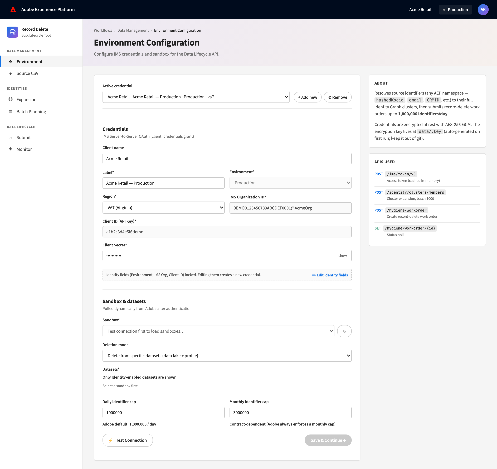

### 13.2 Source CSV — upload identifiers
Single-column CSV of source identifiers, streamed to disk (up to ~4 GB, never
fully in memory), with the source-namespace selector.

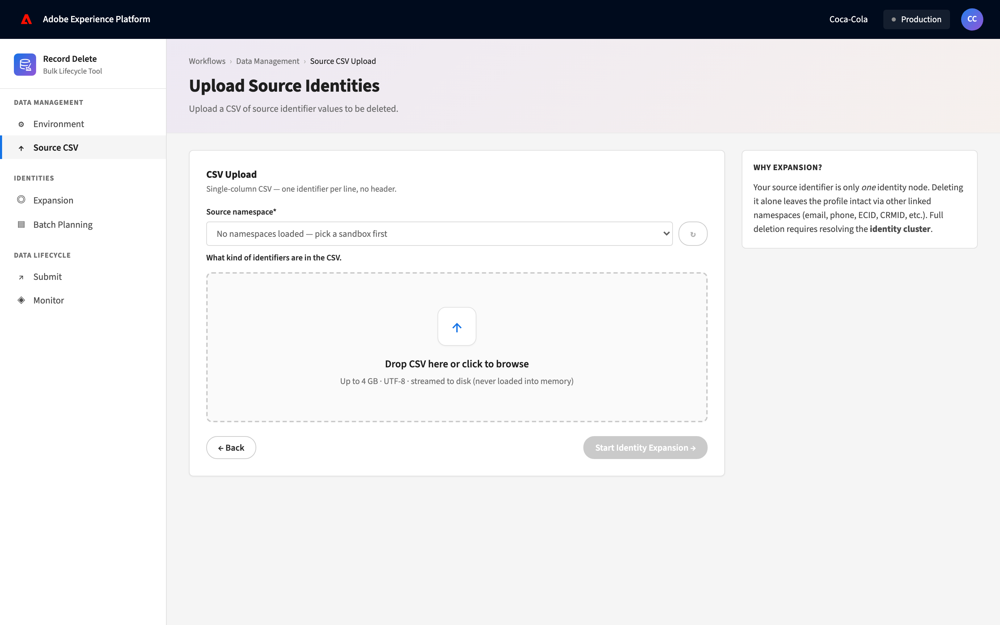

### 13.3 Expansion — resolve the identity graph
Streams each source ID through `POST /clusters/members` (1,000 per call) and
dedups into SQLite. Shows batches, identities found, expansion ratio, and the
per-namespace breakdown.

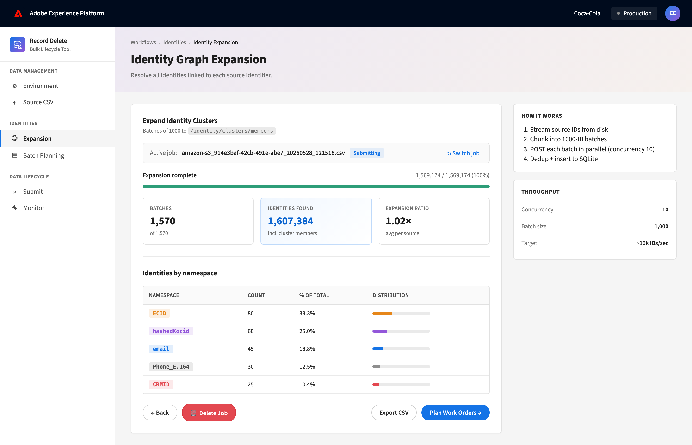

### 13.4 Batch Planning — group into work orders
Packs identities into ≤100,000-identifier work orders bucketed by day/month
under the live quota. Re-plan is blocked once any work order has shipped.

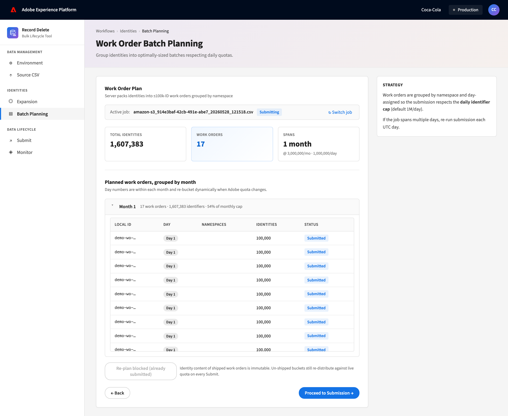

### 13.5 Submit — ship work orders to Adobe
Submits the current day's window, gated by an atomic quota reservation. Here Day 1
(1,000,000) has shipped and the screen has landed on **Day 2** for the remaining
607,383; the quota panel (daily used 1,000,000 / remaining 0) is consistent with
the 10/17 submitted.

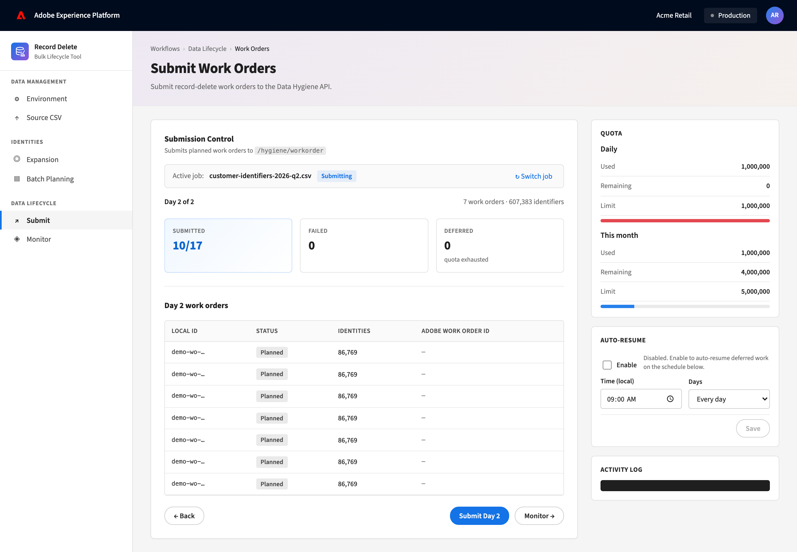

### 13.6 Monitor — track Adobe-side progress
Polls every Adobe-acked work order (60 s, with per-WO backoff) and shows the
in-flight pipeline, per-WO Adobe IDs and statuses, SLA, and downstream services.

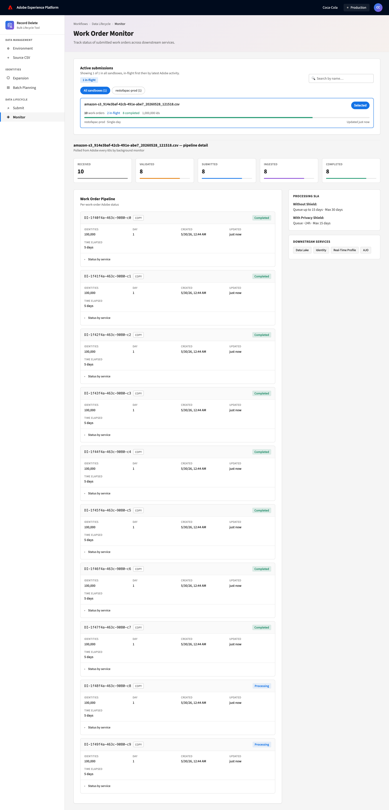

---

*Document end — AEP Data Lifecycle Helper, Design & Architecture Document v3.2.0*
